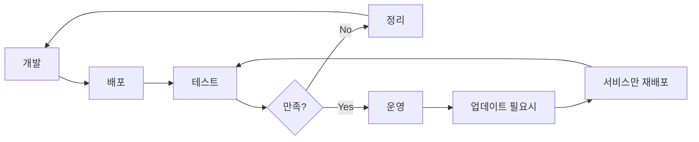

# AWS ECS Streamlit 앱 배포 스크립트

이 디렉토리는 Streamlit HR Analytics 앱을 AWS ECS (Fargate)에 자동 배포하기 위한 스크립트들을 포함합니다.

## 📁 파일 구조

```
infra/ecs/
├── config.sh                    # 공통 설정 및 변수 정의
├── 1-ecr-build-push.sh         # ECR 이미지 빌드 & 푸시
├── 2-setup-infrastructure.sh   # 네트워크 인프라 구성
├── 3-deploy-ecs-service.sh     # ECS 서비스 배포
├── cleanup-resources.sh        # 리소스 정리 (삭제)
├── ecs-task-definition.json    # 정적 Task Definition (참고용)
├── infrastructure.env          # 자동생성된 인프라 정보
└── README.md                   # 이 파일
```

## ⚡ 빠른 시작 (Quick Start)

최소 설정으로 바로 배포하기:

```bash
cd infra/ecs

# 1️⃣ 전제조건 확인
aws sts get-caller-identity  # AWS 인증 확인
docker info                 # Docker 실행 확인

# 2️⃣ 한 번에 배포
./1-ecr-build-push.sh && ./2-setup-infrastructure.sh && ./3-deploy-ecs-service.sh

# 3️⃣ 배포 완료 후 URL 확인
# 스크립트 완료 메시지에서 애플리케이션 URL 확인 가능
```

**⏱️ 예상 소요 시간:** 5-10분

## 🚀 배포 단계

### 전제조건

1. **AWS CLI 설치 및 구성**
   ```bash
   # AWS CLI 설치
   pip install awscli

   # 자격증명 구성 (이미 .env에 설정되어 있으면 스킵)
   aws configure
   ```

2. **Docker 설치 및 실행**
   ```bash
   # Docker가 실행 중인지 확인
   docker info
   ```

3. **프로젝트 루트의 .env 파일 설정**
   ```bash
   AWS_ACCESS_KEY_ID=your_access_key_here
   AWS_SECRET_ACCESS_KEY=your_secret_access_key_here
   AWS_DEFAULT_REGION=ap-northeast-2
   ```

### 배포 실행

배포는 **순서대로** 다음 스크립트들을 실행합니다:

```bash
# 1️⃣ ECR 리포지토리 생성 및 이미지 푸시
./1-ecr-build-push.sh

# 2️⃣ AWS 인프라 구성 (VPC, ALB, 보안그룹 등)
./2-setup-infrastructure.sh

# 3️⃣ ECS 서비스 배포
./3-deploy-ecs-service.sh
```

### 일괄 배포 (한 번에 실행)

```bash
# 모든 단계를 순서대로 실행
./1-ecr-build-push.sh && ./2-setup-infrastructure.sh && ./3-deploy-ecs-service.sh
```

## 🔄 배포 & 정리 워크플로우

### 개발 사이클



### 배포 시나리오별 명령어

**🚀 첫 배포:**
```bash
./1-ecr-build-push.sh && ./2-setup-infrastructure.sh && ./3-deploy-ecs-service.sh
```

**🔄 코드 업데이트 (인프라 유지):**
```bash
./1-ecr-build-push.sh && ./3-deploy-ecs-service.sh
```

**🛠️ 인프라 재구성:**
```bash
./cleanup-resources.sh --service-only  # 서비스만 삭제
./2-setup-infrastructure.sh && ./3-deploy-ecs-service.sh
```

**🗑️ 전체 정리:**
```bash
./cleanup-resources.sh  # 모든 리소스 삭제
```

**🧪 안전한 테스트:**
```bash
./cleanup-resources.sh --dry-run  # 삭제될 리소스 확인
./cleanup-resources.sh --service-only  # 서비스만 삭제하여 비용 절약
```

## 📋 각 스크립트 상세 설명

### 1️⃣ `1-ecr-build-push.sh`

**기능:**
- ECR 리포지토리 생성 (존재하지 않는 경우)
- 기존 Docker 이미지 (`preto-1:latest`) 태깅
- ECR 로그인 후 이미지 푸시
- 타임스탬프 태그 생성 (롤백용)

**출력:**
```
📦 ECR Repository: preto-streamlit-app
🏷️  Latest Tag: 201023212334.dkr.ecr.ap-northeast-2.amazonaws.com/preto-streamlit-app:latest
🏷️  Backup Tag: 201023212334.dkr.ecr.ap-northeast-2.amazonaws.com/preto-streamlit-app:20240915-143022
```

### 2️⃣ `2-setup-infrastructure.sh`

**기능:**
- VPC 및 서브넷 확인 (기본 VPC 사용)
- 보안 그룹 생성 (HTTP 80, Streamlit 8501 포트)
- Application Load Balancer 생성
- Target Group 및 Listener 설정
- IAM 역할 생성 (Task Execution Role, Task Role)
- CloudWatch Logs 그룹 생성

**생성 리소스:**
- ALB: `preto-streamlit-alb`
- Target Group: `preto-streamlit-tg`
- Security Group: `preto-streamlit-sg`
- IAM Roles: `ecsTaskExecutionRole`, `ecsTaskRole`
- Log Group: `/ecs/preto-streamlit-app`

### 3️⃣ `3-deploy-ecs-service.sh`

**기능:**
- ECS 클러스터 생성
- Task Definition 동적 생성 및 등록
- ECS 서비스 생성/업데이트
- 서비스 안정화 대기 (최대 10분)
- 헬스체크 상태 확인
- 배포 결과 요약

**배포 결과:**
```
🌐 애플리케이션 URL: http://preto-streamlit-alb-xxxxx.ap-northeast-2.elb.amazonaws.com
```

## ⚙️ 설정 커스터마이징

### `config.sh` 주요 설정값

```bash
# 프로젝트 정보
PROJECT_NAME="preto"
APP_NAME="streamlit-app"
ENVIRONMENT="prod"

# 컴퓨팅 리소스
ECS_CPU="256"       # 0.25 vCPU
ECS_MEMORY="512"    # 512 MB
ECS_DESIRED_COUNT="1"

# 네트워킹
CONTAINER_PORT="8501"
ALB_PORT="80"
```

### 스케일링 조정

인스턴스 수를 변경하려면:

```bash
# config.sh에서 ECS_DESIRED_COUNT 수정 후
./3-deploy-ecs-service.sh
```

### 리소스 증설

CPU/메모리를 증설하려면:

```bash
# config.sh에서 ECS_CPU, ECS_MEMORY 수정 후
./3-deploy-ecs-service.sh
```

## 🛠️ 유용한 명령어

### 서비스 상태 확인
```bash
aws ecs describe-services \
  --cluster preto-streamlit-app-cluster \
  --services preto-streamlit-app-service \
  --region ap-northeast-2
```

### 실행 중인 태스크 목록
```bash
aws ecs list-tasks \
  --cluster preto-streamlit-app-cluster \
  --service-name preto-streamlit-app-service \
  --region ap-northeast-2
```

### CloudWatch 로그 실시간 확인
```bash
aws logs tail /ecs/preto-streamlit-app --follow --region ap-northeast-2
```

### Target Group 헬스체크 상태
```bash
aws elbv2 describe-target-health \
  --target-group-arn arn:aws:elasticloadbalancing:ap-northeast-2:201023212334:targetgroup/preto-streamlit-tg/xxxxx \
  --region ap-northeast-2
```

## 🔧 트러블슈팅

### 1. 이미지 푸시 실패
- AWS 자격증명 확인: `aws sts get-caller-identity`
- Docker 데몬 상태 확인: `docker info`
- ECR 로그인 재시도: `aws ecr get-login-password --region ap-northeast-2 | docker login --username AWS --password-stdin 201023212334.dkr.ecr.ap-northeast-2.amazonaws.com`

### 2. 헬스체크 실패
- 애플리케이션이 포트 8501에서 실행되는지 확인
- 헬스체크 경로 `/`가 200 응답을 반환하는지 확인
- CloudWatch 로그에서 오류 메시지 확인

### 3. 서비스 시작 실패
- Task Definition의 CPU/메모리 설정 확인
- IAM 역할 권한 확인
- ECR 이미지 URI 확인

### 4. 네트워킹 문제
- 보안 그룹 인바운드 규칙 확인 (포트 80, 8501)
- 서브넷의 인터넷 게이트웨이 연결 확인
- ALB와 Target Group 연결 상태 확인

## 🧹 리소스 정리

### 자동 정리 스크립트 (권장)

배포된 모든 리소스를 안전하게 정리하는 스크립트를 제공합니다:

```bash
# 전체 리소스 삭제 (확인 후)
./cleanup-resources.sh

# 확인 없이 바로 삭제
./cleanup-resources.sh --force

# 삭제 예정 리소스 확인만 (실제 삭제 안함)
./cleanup-resources.sh --dry-run

# ECS 서비스만 삭제 (인프라 유지)
./cleanup-resources.sh --service-only

# ECR 이미지는 유지하고 나머지 삭제
./cleanup-resources.sh --keep-ecr

# CloudWatch 로그는 유지하고 나머지 삭제
./cleanup-resources.sh --keep-logs
```

### 정리 옵션 설명

| 옵션 | 설명 |
|------|------|
| `--all` | 모든 리소스 삭제 (기본값) |
| `--service-only` | ECS 서비스만 삭제, 인프라는 유지 |
| `--keep-ecr` | ECR 리포지토리와 이미지 유지 |
| `--keep-logs` | CloudWatch 로그 그룹 유지 |
| `--dry-run` | 삭제할 리소스 목록만 출력 |
| `--force` | 확인 없이 바로 삭제 |
| `-h, --help` | 도움말 출력 |

### 삭제되는 리소스 목록

- ✅ ECS Service & Cluster
- ✅ Task Definitions (모든 리비전)
- ✅ Application Load Balancer & Target Group
- ✅ Security Group
- ✅ IAM Roles (Task Execution & Task Role)
- ✅ ECR Repository & Images (옵션)
- ✅ CloudWatch Log Group (옵션)

### 수동 정리 (참고용)

자동 스크립트 대신 수동으로 정리하려면:

```bash
# ECS 서비스 삭제
aws ecs delete-service --cluster preto-streamlit-app-cluster --service preto-streamlit-app-service --region ap-northeast-2

# ECS 클러스터 삭제 (모든 서비스 삭제 후)
aws ecs delete-cluster --cluster preto-streamlit-app-cluster --region ap-northeast-2

# ALB 삭제
aws elbv2 delete-load-balancer --load-balancer-arn arn:aws:elasticloadbalancing:ap-northeast-2:201023212334:loadbalancer/app/preto-streamlit-alb/xxxxx

# Target Group 삭제
aws elbv2 delete-target-group --target-group-arn arn:aws:elasticloadbalancing:ap-northeast-2:201023212334:targetgroup/preto-streamlit-tg/xxxxx

# ECR 리포지토리 삭제 (이미지도 함께 삭제됨)
aws ecr delete-repository --repository-name preto-streamlit-app --force --region ap-northeast-2
```

## 📞 지원

배포 과정에서 문제가 발생하면:

1. CloudWatch 로그 확인
2. AWS Console에서 리소스 상태 확인
3. 스크립트의 로그 출력 메시지 확인
4. AWS 서비스 상태 페이지 확인

## 📝 변경 이력

- **v1.1** (2024-09-15): 리소스 정리 스크립트 추가
  - `cleanup-resources.sh` 스크립트 생성
  - 멱등성 보장 및 다양한 정리 옵션 제공
  - 배포/정리 워크플로우 가이드 추가
  - Dry-run 모드 지원

- **v1.0** (2024-09-15): 초기 배포 스크립트 세트 생성
  - ECR 빌드/푸시 자동화
  - 인프라 구성 자동화
  - ECS 서비스 배포 자동화