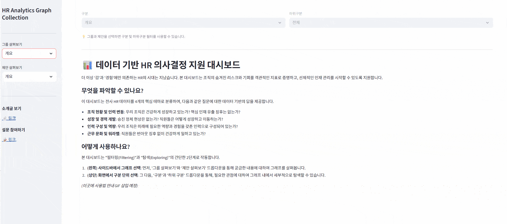

## 📊 데이터 기반 HR 의사결정 지원 대시보드

더 이상 '감'과 '경험'에만 의존하는 HR의 시대는 지났습니다. 본 대시보드는 조직의 숨겨진 리스크와 기회를 객관적인 지표로 증명하고, 선제적인 인재 관리를 시작할 수 있도록 지원합니다.

#### 무엇을 파악할 수 있나요?

이 대시보드는 전사 HR 데이터를 4개의 핵심 테마로 분류하여, 다음과 같은 질문에 대한 데이터 기반의 답을 제공합니다.

- **조직 현황 및 인력 변동**: 우리 조직은 건강하게 성장하고 있는가? 핵심 인재 유출 징후는 없는가?
- **성장 및 경력 개발**: 승진 정체 현상은 없는가? 직원들은 어떻게 성장하고 이동하는가?
- **인력 구성 및 역량**: 우리 조직은 미래에 필요한 역량과 경험을 갖춘 인력으로 구성되어 있는가?
- **근무 문화 및 워라밸**: 직원들은 번아웃 징후 없이 건강하게 일하고 있는가?

#### 어떻게 사용하나요?

본 대시보드는 "필터링(Filtering)"과 "탐색(Exploring)"의 간단한 2단계로 작동합니다.

1. **(왼쪽) 사이드바에서 그래프 선택**: 먼저, '그룹 살펴보기'와 '제안 살펴보기' 드롭다운을 통해 궁금한 내용에 대하여 그래프를 살펴봅니다.
2. **(상단) 화면에서 구분 단위 선택**: 그 다음, '구분'과 '하위 구분' 드롭다운을 통해, 필요한 관점에 대하여 그래프 내에서 세부적으로 탐색할 수 있습니다.

